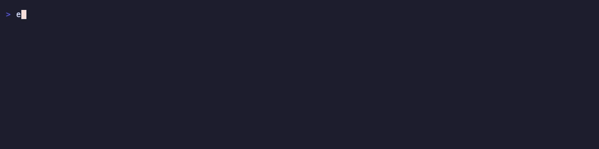
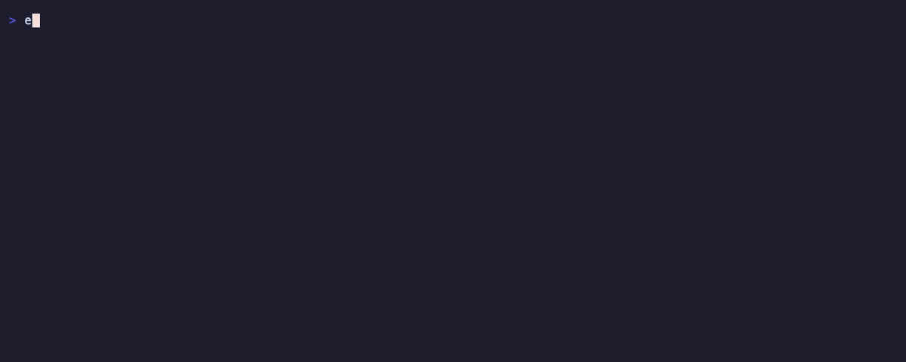

# edx — Edge Delta CLI

`edx` is the Edge Delta command line interface. It covers the three Edge Delta
products:

| Product | Commands |
|---------|----------|
| **Pipeline** | `pipelines`, `fleet`, `capture`, `health`, `ingest` |
| **Observability** | `logs`, `patterns`, `metrics`, `traces`, `events`, `monitors`, `dashboards`, `facets`, `service-map` |
| **AI Teammate** | `ai connectors`, `ai activity` |

Plus `api` as a raw escape hatch for any endpoint, and `auth` for credentials.

## See it in action

Search logs with CQL:



List pipelines across the fleet:



Discover and query metrics:


Surface negative log patterns (clustered error signatures):


The clips are generated with [vhs](https://github.com/charmbracelet/vhs) from
the tape scripts in [`demo/`](demo/) — re-record with `vhs demo/<name>.tape`
(requires an authenticated `edx`; no credentials appear on screen).

## Install

Homebrew (macOS and Linux, Intel and Apple Silicon):

```bash
brew install edgedelta/pack/edx
# or
brew tap edgedelta/pack
brew install edx
```

Go toolchain:

```bash
go install github.com/edgedelta/edx@latest
# or from a checkout:
make install
```

## Authenticate

Create an API token in the Edge Delta web app (Admin → API Tokens), then:

```bash
edx auth login --token <api-token> --org-id <org-id>
edx auth status
```

Or use environment variables (they override the config file):

```bash
export ED_API_TOKEN=...
export ED_ORG_ID=...
export ED_API_URL=https://api.edgedelta.com   # optional
```

Multiple organizations are supported via profiles:

```bash
edx auth login --profile staging --api-url https://api.staging.edgedelta.com --token ... --org-id ...
edx --profile staging pipelines list
```

Config lives in `~/.config/edx/config.yaml` (mode 0600).

## Output

Every command prints pretty JSON by default. Other formats:

```bash
edx pipelines list --output table
edx pipelines list --output table --columns id,tag,fleet_type,status,updated
edx monitors list --output yaml
edx logs search -q 'error' --output csv --columns timestamp,severity_text,body
```

## Quick reference

```bash
# --- Observability ----------------------------------------------------------
edx logs search -q 'service.name:"api" AND severity_text:"ERROR"' --lookback 1h
edx logs graph -q 'severity_text:"ERROR"' --group-by service.name --lookback 6h
edx patterns list --summary --lookback 1h          # clustered log signatures
edx patterns list --negative --query 'service.name:"api"'
edx metrics list --keyword cpu
edx metrics query --name http.request.duration --agg avg --group-by service.name
edx traces search -q 'status.code:"ERROR"' --include-children
edx events search -q 'event.type:"pattern_anomaly"' --lookback 6h
edx monitors list --output table
edx monitors states                                 # triggered/resolved states
edx service-map --lookback 1h
edx dashboards list

# --- Schema discovery (do this before writing CQL) --------------------------
edx facets keys --scope log
edx facets options --scope log --facet service.name
edx facets options --scope metric --facet name      # all metric names

# --- Pipeline / fleet management --------------------------------------------
edx pipelines list --output table
edx pipelines get <conf-id>                         # includes config content
edx pipelines history <conf-id>                     # version history
edx pipelines validate --file pipeline.yaml
edx pipelines save <conf-id> --file pipeline.yaml -d "add k8s source"
edx pipelines deploy <conf-id> <version> --yes      # deploy or roll back
edx pipelines agents <conf-id>
edx pipelines status <conf-id>
edx fleet agents
edx fleet deployments
edx health problems

# --- Live capture (debug data flowing through nodes) -------------------------
edx capture start <conf-id> --duration 2m --nodes mask_pii
edx capture status <task-id>
edx capture results <conf-id>

# --- AI Teammate -------------------------------------------------------------
edx ai connectors list
edx ai connectors specs
edx ai connectors update --file connector.json
edx ai activity

# --- Anything else -----------------------------------------------------------
edx api GET /v1/orgs/{org}/users
edx api GET /tokens                                 # org-relative shorthand
edx api POST /pipelines/<conf-id>/save --data @save.json
```

## CQL in 30 seconds

```
service.name:"api"                       field equals
service.name:("api" OR "web")            multiple values
-severity_text:"DEBUG"                   negation
error timeout                            full-text (logs/patterns/events only)
@response.code > 400                     numeric comparison on attributes
```

Regular expressions are **not** supported. Metrics and traces require
`field:"value"` syntax (no full-text). Time ranges: `--lookback 15m|1h|24h`
(Go durations) or `--from/--to` in ISO 8601 (`2006-01-02T15:04:05.000Z`).

## Development

```bash
make build    # bin/edx
make test
make vet
```

## Related

- [edgedelta/agent-skills](https://github.com/edgedelta/agent-skills) — AI agent skills built on edx
- [edgedelta/edgedelta-mcp-server](https://github.com/edgedelta/edgedelta-mcp-server) — MCP server for Edge Delta
